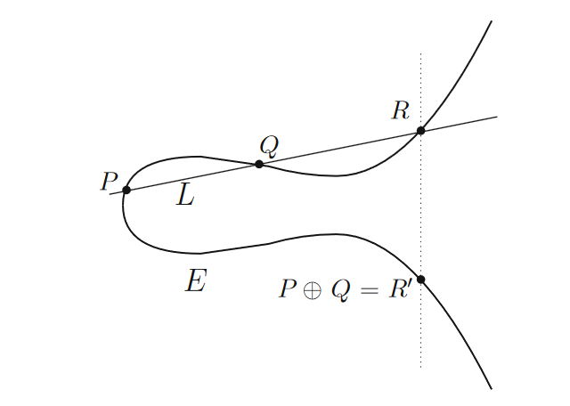

Introduction to ECC
-
Basics of elliptic curves and their usage in cryptography

### Elliptic Curves
Elliptic curves refer to the solution to the equations of the form: $Y^2 = X^3 + AX + B$, known as Weierstrass equations, as well as an extra point $O$ at infinity. The constants $A$ and $B$ must satisfy $4A^3 + 27B^2 \ne 0$.  
$4A^3 + 27B^2$ is the discriminant of the elliptic curve, and we prevent it from being 0 to prevent repeated roots.

Elliptic curves have a feature known as point addition, an operator that takes two points on the same curve and produces a third point. In point addition, a new point is obtained by:
1. Drawing a line between the two originial points
2. Finding the third intersection of this line with the curve
3. Taking the horizontal reflection of this point on the curve

Point addition is commutative (point addition follows the properties of an [abelian group](https://en.wikipedia.org/wiki/Abelian_group)).  
The point $O$ is the identity for the group, as $P+O=P$.
Point addition algorithm: $P+Q$ under $Y^2 = X^3 + AX + B$
1. If $P=O$, then $P+Q=Q$
2. Otherwise, if $Q=O$, then $P+Q=P$
3. Otherwise, write $P=(x_1, y_1)$ and $Q=(x_2, y_2)$
4. If $x_1=x_2$ and $y_1=-y_2$, then $P+Q=O$
5. Otherwise:
    - If $P \ne Q$, $\lambda = \frac{y_2-y_1}{x_2-x_1}$
    - If $P=Q$, $\lambda = \frac{3x_1^2+A}{2y_1}$
6. Let $x_3=\lambda^2-x_1-x_2$ and $y_3=\lambda(x_1-x_3)-y_1$
7. $P+Q=(x_3, y_3)$

### Usage in Cryptography (over finite fields)
In cryptography, elliptic curves used have coordinates in a finite field $F_p$.  
This means that all $X$ and $Y$ values $\in F_p$ in the curve $Y^2 = X^3 + AX + B$.  
The Elliptic Curve Discrete Logarithm Problem (ECDLP) is the problem of finding an integer $n$ such that $Q=nP$, where $Q$ and $P$ are points in $E(F_p)$.

  

Some cool resources:  
- https://blog.cloudflare.com/a-relatively-easy-to-understand-primer-on-elliptic-curve-cryptography/
- An Introduction to Mathematical Cryptography by *Jeffrey Hoffstein, Jill Pipher, Joseph H. Silverman*
- https://cryptohack.org/courses/elliptic/bg/