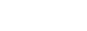

RSA Attacks
-
Textbook attacks on RSA, most can be solved using [RsaCtfTool](https://github.com/RsaCtfTool/RsaCtfTool)  

### Factorisation
For smaller $n$ values, factorisation can be used to get $p$ and $q$, usually using http://factordb.com/.  
When small primes are used to generate $n$, [Pollard's rho algorithm](https://en.wikipedia.org/wiki/Pollard%27s_rho_algorithm) ($O(\sqrt n)$ time complexity) or [elliptic-curve factorisation (ecm)](https://en.wikipedia.org/wiki/Lenstra_elliptic-curve_factorization) can be used to factorise $n$.  
Use `ecm.factor(n)` in [SageMath](https://doc.sagemath.org/html/en/reference/interfaces/sage/interfaces/ecm.html) for elliptic curve factorisation.  
[Script (using Factordb)](scripts/Factor_n.py)

 

### Cube Root Attack
When $e$ and $m$ are small, we can bruteforce the modulo as $m^e = C + kn$ where $k$ is a constant. After which we just need to take the $e$th root to get $m$.  
[Script](scripts/Cube_Root_Attack.py)

 

### Common Modulus
In the scenario where we have  

  

  

We are able to solve for $n$ if $e_1$ and $e_2$ have a gcd of 1.
All we need to do is calculate the bezout coefficients for $e_1$ and $e_2$ such that $e_{1}*u + e_{2}*v = 1$, then take each $C$ to the power of the respective coefficient.
After this, we can multiply them together, giving us
$$C_1 * C_2 = m^{e_{1}*u + e_{2}*v} \mod n$$
Which is equal to $m^1$.  
[Script](scripts/Common_Mod.py)

 

### Fermat's attack
When $p$ and $q$ are close ($p-q < n^{\frac{1}{4}}$), [Fermat's factorization method](https://en.wikipedia.org/wiki/Fermat%27s_factorization_method) can be used to factorise $n$.  
We do this by expressing $n$ as $(a-b)(a+b)$.  
[Script](scripts/Fermat_Attack.py)

 

### Hastad's Broadcast Attack
When we have

  

  
