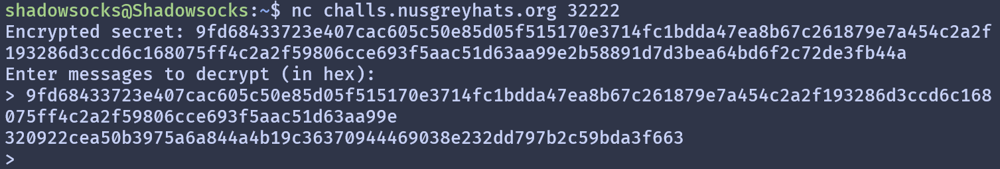

GreyCTF 2024 Qualifiers
-
Managed to solve 3 Crypto challs and qualified for finals. Honestly pretty disappointing for me, definitely could have solved the challs faster and try other challs, but oh well.

### Filter Ciphertext
> I rolled my own crypto. What could go wrong?

This challenge is a lot simpler than it looks.

```python
from Crypto.Cipher import AES
import os

with open("flag.txt", "r") as f:
    flag = f.read()

BLOCK_SIZE = 16
iv = os.urandom(BLOCK_SIZE)

xor = lambda x, y: bytes(a^b for a,b in zip(x,y))

key = os.urandom(16)

def encrypt(pt):
    cipher = AES.new(key=key, mode=AES.MODE_ECB)
    blocks = [pt[i:i+BLOCK_SIZE] for i in range(0, len(pt), BLOCK_SIZE)]
    tmp = iv
    ret = b""
    
    for block in blocks:
        res = cipher.encrypt(xor(block, tmp))
        ret += res
        tmp = xor(block, res)
        
    return ret

    
def decrypt(ct):
    cipher = AES.new(key=key, mode=AES.MODE_ECB)
    blocks = [ct[i:i+BLOCK_SIZE] for i in range(0, len(ct), BLOCK_SIZE)]

    for block in blocks:
        if block in secret_enc:
            blocks.remove(block)
    
    tmp = iv
    ret = b""
    
    for block in blocks:
        res = xor(cipher.decrypt(block), tmp)
        ret += res
        tmp = xor(block, res)
    
    return ret
    
secret = os.urandom(80)
secret_enc = encrypt(secret)

print(f"Encrypted secret: {secret_enc.hex()}")

print("Enter messages to decrypt (in hex): ")

while True:
    res = input("> ")

    try:
        enc = bytes.fromhex(res)

        if (enc == secret_enc):
            print("Nice try.")
            continue
        
        dec = decrypt(enc)
        if (dec == secret):
            print(f"Wow! Here's the flag: {flag}")
            break

        else:
            print(dec.hex())
        
    except Exception as e:
        print(e)
        continue

```
From the description and source code, we can clearly see this is an AES oracle challenge with a custom AES mode. We can take a look at the `encrypt` function to see how it works:

```python
def encrypt(pt):
    cipher = AES.new(key=key, mode=AES.MODE_ECB)
    blocks = [pt[i:i+BLOCK_SIZE] for i in range(0, len(pt), BLOCK_SIZE)]
    tmp = iv
    ret = b""

    for block in blocks:
        res = cipher.encrypt(xor(block, tmp))
        ret += res
        tmp = xor(block, res)

    return ret
```
This custom mode is very similar to CBC. However, apart from XORing the previous ciphertext block, it also XORs the previous plaintext block with the current plaintext block.  
Okay cool, now we can look at the oracle.

```python
secret = os.urandom(80)
secret_enc = encrypt(secret)

print(f"Encrypted secret: {secret_enc.hex()}")

print("Enter messages to decrypt (in hex): ")

while True:
    res = input("> ")

    try:
        enc = bytes.fromhex(res)

        if (enc == secret_enc):
            print("Nice try.")
            continue
        
        dec = decrypt(enc)
        if (dec == secret):
            print(f"Wow! Here's the flag: {flag}")
            break

        else:
            print(dec.hex())
        
    except Exception as e:
        print(e)
        continue
```
We are provided with an encrypted secret and a decryption oracle. The goal is to find an input which will give the secret when decrypted. However, it rejects the encrypted secret as input.  
Seems pretty unsolvable, so let's look for a vulnerability in `decrypt`.

```python
def decrypt(ct):
    cipher = AES.new(key=key, mode=AES.MODE_ECB)
    blocks = [ct[i:i+BLOCK_SIZE] for i in range(0, len(ct), BLOCK_SIZE)]

    for block in blocks:
        if block in secret_enc:
            blocks.remove(block)
    
    tmp = iv
    ret = b""
    
    for block in blocks:
        res = xor(cipher.decrypt(block), tmp)
        ret += res
        tmp = xor(block, res)
    
    return ret
```
Hmm ok, nothing too abnormal, but we do see a second filtering of the ciphertext here. It removes encrypted blocks that are in the encrypted secret. At this point I didn't see the vulnerability unfortunately, so I messed around with the oracle.  

I noticed something strange when I removed the last block of the ciphertext and sent it to the oracle.  
  
Obviously it passes the first check, but why is there still output after the second filtering?  

The reason is that it removes blocks from the list.  
Python's list remove function brings the rest of the list forward after removing. Since this is done in a for loop, we end up skipping an element in the list, since the elements are brought foraward but the for loop progresses to the next index.  

This means that every second block will skip the check (assuming the first block is removed). So, we can submit every block twice in a row, and we get the flag.  

We get the flag: `grey{00ps_n3v3r_m0d1fy_wh1l3_1t3r4t1ng}`